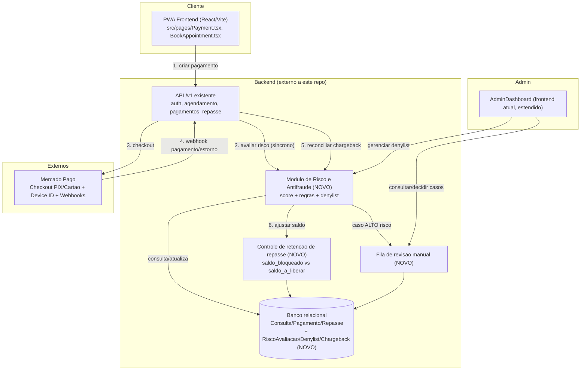
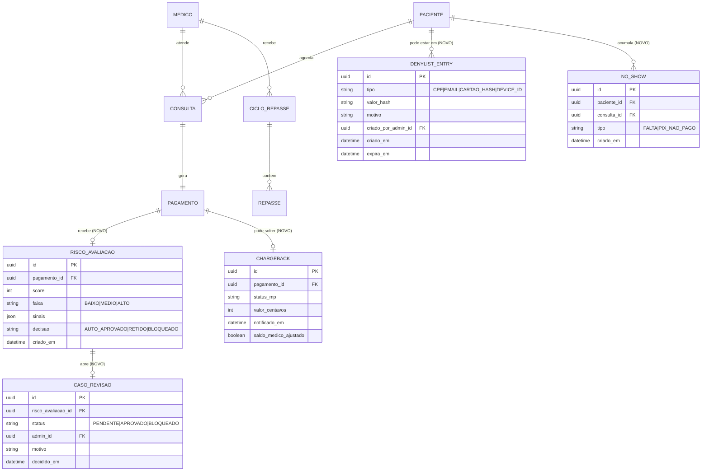

<!-- ai-summary
System: blueprint tecnico para um subsistema de prevencao de fraude e inadimplencia nas consultas (pagamento, agendamento e repasse).
Flow: paciente inicia agendamento/pagamento -> checagens sincronas (denylist/velocity) -> score de risco -> aprovar automatico | reter repasse | enviar para revisao manual admin -> webhook de estorno reconciliado -> ciclo de repasse ajustado.
Owner: arquitetura.
Systems: novo modulo de Risco no backend, src/pages/*, src/services/api.ts, Mercado Pago (checkout + webhooks), AdminDashboard.
Status: draft - depende de validacao com backend e produto (ver acoes de acompanhamento).
-->

# Arquitetura - Sistema de Prevencao de Fraude e Inadimplencia em Consultas

> Este documento nao encontrou um `docs/estudo-do-contexto.md` no repositorio. O projeto
> ja existe em producao e mantem seu contexto de dominio distribuido no "segundo cerebro"
> em `docs/knowledge`, `docs/processes`, `docs/systems` e `docs/decisions` (ver
> [Hub de Documentacao](README.md)). Este blueprint foi construido a partir dessas fontes,
> citadas em `related` acima, com foco especifico na demanda: **reduzir fraude de pagamento
> e inadimplencia associada a consultas**.

## 1. Contexto e problema

O Seja Atendido e uma PWA de telemedicina (React + Vite) que conecta pacientes a medicos.
O paciente agenda, paga via **PIX ou cartao (Mercado Pago)** e o valor liquido se acumula em
`saldo_a_liberar` do medico, repassado automaticamente toda semana ou antecipado mediante
taxa (ver [ADR 0002](decisions/adr-0002-estrategia-repasse-medico.md)). O backend (fora
deste repositorio, hospedado em Render) e a fonte de verdade financeira; o frontend consome
via `/v1/pagamentos/*` e `/medicos/me/*`.

Riscos identificados a partir do fluxo atual documentado:

| # | Risco | Onde ocorre hoje | Evidencia |
|---|---|---|---|
| R1 | **Estorno/chargeback apos repasse ja liberado** — cartao contestado depois que o valor ja foi antecipado ou repassado ao medico | Pagamento cartao -> ciclo automatico ou antecipacao | [pagamentos-consulta.md](processes/pagamentos-consulta.md), [ADR 0002](decisions/adr-0002-estrategia-repasse-medico.md) |
| R2 | **Fraude de cartao / "carding"** (cartao roubado testado na plataforma) | `POST /v1/pagamentos/cartao` sem checagem de risco documentada | [api-backend-e-contratos.md](systems/api-backend-e-contratos.md) |
| R3 | **Contas multiplas/fraudulentas** para repetir tentativas apos bloqueio | Signup sem verificacao documentada de unicidade forte | [autenticacao-e-autorizacao.md](processes/autenticacao-e-autorizacao.md) |
| R4 | **No-show/inadimplencia operacional**: paciente agenda e nao paga (PIX pendente nunca concluido) ou falta, ocupando a agenda do medico | Agendamento cria consulta antes da confirmacao de pagamento | [agendamento-consulta.md](processes/agendamento-consulta.md) |
| R5 | **Fraude de identidade profissional** (CRM invalido/falso) recebendo repasses | `/crm-validation` — fluxo de aprovacao existe, mas sem reverificacao periodica documentada | [roteiro-testes-producao.md](plans/roteiro-testes-producao.md) |
| R6 | **Disputa indevida ("friendly fraud")**: paciente usa a consulta e contesta a cobranca alegando desconhecimento | Sem trilha de evidencia de consumo do servico associada ao pagamento | — |

O risco financeiro mais critico e **R1**, pois o ADR-0002 tornou o repasse **automatico e,
opcionalmente, imediato mediante taxa** — isso reduz a janela de reacao da plataforma caso um
pagamento por cartao seja contestado depois que o dinheiro ja saiu para o medico.

## 2. Objetivo e escopo

**Objetivo:** introduzir um subsistema de **Risco e Antifraude** que avalie cada tentativa de
pagamento/agendamento, contenha a exposicao financeira da plataforma a estornos e reduza a
inadimplencia operacional (no-show), sem degradar a experiencia de checkout da maioria dos
usuarios legitimos.

**Fora de escopo:** renegociar o modelo comercial de repasse em si (ADR-0002 permanece
valido), trocar o gateway de pagamento (Mercado Pago) e qualquer feature clinica.

## 3. Requisitos

### Requisitos funcionais (RF)

| ID | Requisito |
|---|---|
| RF01 | Calcular um score de risco para cada tentativa de pagamento antes de confirmar/liberar a consulta |
| RF02 | Bloquear automaticamente pagamentos de risco alto e enviar para fila de revisao manual |
| RF03 | Reter (hold) o repasse ao medico durante uma janela de seguranca para pagamentos por cartao |
| RF04 | Manter lista de bloqueio (denylist) de CPF, e-mail, hash de cartao e dispositivo |
| RF05 | Reconciliar webhooks de estorno/chargeback do Mercado Pago, ajustando saldo do medico e status da consulta |
| RF06 | Aplicar politica de no-show/inadimplencia: taxa e limite de faltas antes de exigir pagamento antecipado obrigatorio |
| RF07 | Disponibilizar painel administrativo de revisao de casos sinalizados (aprovar/bloquear) com trilha de auditoria |
| RF08 | Reverificar periodicamente o CRM do medico |

### Requisitos nao funcionais (RNF)

| ID | Requisito |
|---|---|
| RNF01 | Nunca armazenar dados de cartao no backend proprio (manter escopo PCI-DSS minimo via Mercado Pago) |
| RNF02 | Aderencia a LGPD: dados de risco tem finalidade declarada (prevencao a fraude/legitimo interesse, ja citado em [Lgpd.tsx](../src/pages/Lgpd.tsx)) e retencao limitada |
| RNF03 | Checagens sincronas de risco devem responder em ate ~300ms (p95) para nao degradar o checkout |
| RNF04 | Resiliencia: indisponibilidade do motor de risco nao pode bloquear 100% dos pagamentos (fail-open controlado) |
| RNF05 | Toda decisao de bloqueio/retencao deve ser auditavel (motivo, regra, score, ator) |
| RNF06 | Regras devem ser configuraveis sem exigir deploy de codigo (extensibilidade) |
| RNF07 | Observabilidade: metricas de taxa de chargeback, falso-positivo e tempo medio de revisao |

## 4. Stack tecnologica e justificativas

O backend atual e externo a este repositorio (consumido via REST em
`https://sejaatendido-backend.onrender.com`, ver [api.ts](../src/config/api.ts)) e sua stack
interna nao esta documentada no "segundo cerebro". As escolhas abaixo assumem integracao com
o que ja existe (evitar reescrita) e sao propostas para validacao conjunta com o time backend.

| Camada | Escolha proposta | Justificativa |
|---|---|---|
| Motor de risco | **Modulo interno no backend existente** (nao microsservico dedicado na v1) | Evita complexidade operacional desnecessaria para o volume atual do produto; reavaliar como servico isolado apenas se o volume de transacoes justificar escala independente (ver ADR-01) |
| Sinais de dispositivo/antifraude no checkout | **SDK oficial do Mercado Pago** (`@mercadopago/sdk-react`, ja presente em `package.json`) + Device ID do MP | Reaproveita infraestrutura antifraude ja mantida pelo adquirente, sem construir fingerprinting proprio do zero (ver ADR-04) |
| Contadores de velocidade (rate/velocity checks) | **Cache in-memory/Redis** no backend (contagem de tentativas por CPF/cartao/IP/dispositivo em janela deslizante) | Baixa latencia, padrao de mercado para "velocity checks" antifraude |
| Persistencia de casos de risco/denylist | **Mesmo banco relacional do backend** (novas tabelas, sem novo SGBD) | Mantem consistencia transacional com pagamento/consulta/repasse; evita novo ponto de falha |
| Webhooks de estorno | **Endpoint dedicado de webhook** validando assinatura do Mercado Pago | Reconciliacao assincrona e a unica fonte confiavel de eventos de chargeback; nunca confiar em confirmacao vinda apenas do cliente/frontend |
| Painel de revisao | **Extensao do `AdminDashboard` (frontend atual)** | Reuso de rota/role ADMIN ja protegida (`ProtectedRoute`), evita nova aplicacao administrativa |
| Antifraude avancado (fase futura) | **Avaliar bureau terceirizado (ex.: solucao antifraude do proprio Mercado Pago) somente se a taxa de chargeback justificar o custo** | Evita over-engineering; comecar com regras + sinais nativos antes de contratar solucao paga |

## 5. Diagrama de arquitetura



## 6. Modelo de dados

### Diagrama ER (entidades novas em destaque)



### Descricao das entidades novas

- **RiscoAvaliacao**: registro imutavel do score calculado para cada pagamento; guarda os
  sinais usados (velocity, denylist hit, reputacao de conta) para auditoria (RNF05).
- **CasoRevisao**: fila de trabalho do admin para pagamentos com faixa `ALTO`; guarda decisao
  e responsavel.
- **DenylistEntry**: bloqueios reutilizaveis por CPF/e-mail/hash de cartao/device id, com
  expiracao opcional (evita bloqueio permanente sem revisao).
- **Chargeback**: espelha o evento de estorno recebido via webhook do Mercado Pago e controla
  se o ajuste no saldo do medico ja foi aplicado (idempotencia).
- **NoShow**: acumula faltas e pendencias de PIX nao concluidas por paciente, usado para
  disparar a politica de pagamento antecipado obrigatorio (RF06).

`Consulta`, `Pagamento`, `Repasse` e `CicloRepasse` ja existem hoje (ver
[pagamentos-consulta.md](processes/pagamentos-consulta.md)) e nao mudam de forma — apenas
ganham referencia opcional para as entidades novas.

## 7. Contratos de API (novos/estendidos)

| Metodo | Rota | Descricao | Consumidor |
|---|---|---|---|
| POST | `/v1/risco/avaliar` | Avalia risco de uma tentativa de pagamento (chamado internamente pelo backend antes de confirmar `/v1/pagamentos/*`) | Backend interno |
| GET | `/admin/risco/casos?status=PENDENTE` | Lista casos de revisao manual pendentes | AdminDashboard (novo) |
| POST | `/admin/risco/casos/:id/decisao` | Registra decisao do admin (`APROVAR`/`BLOQUEAR`) com motivo | AdminDashboard (novo) |
| POST | `/admin/denylist` | Cria entrada de bloqueio (CPF/e-mail/cartao hash/device id) | AdminDashboard (novo) |
| DELETE | `/admin/denylist/:id` | Remove/expira uma entrada de bloqueio | AdminDashboard (novo) |
| POST | `/webhooks/mercadopago/chargeback` | Recebe notificacao de estorno/disputa do Mercado Pago (assinatura validada) | Mercado Pago (novo) |
| POST | `/consultas/:id/no-show` | Marca falta do paciente ou PIX nao concluido, incrementando contador | Backend (job) / Admin (novo) |
| GET | `/medicos/me/saldo` | **Estendido**: passa a incluir `saldo_retido_centavos` e `previsao_liberacao` alem de `saldo_a_liberar` | Frontend (`BalanceCard.tsx`, `Earnings.tsx`) |
| POST | `/medicos/me/repasses/imediato` | **Estendido**: passa a recusar (4xx) antecipacao quando houver saldo retido por risco `MEDIO`/`ALTO` pendente | Frontend (`Earnings.tsx`) |

Todos os novos endpoints seguem o prefixo/convencao ja adotada (`/v1` para dominio de
pagamento existente; `/admin` e `/webhooks` como novos namespaces, alinhados ao padrao de
autenticacao Bearer descrito em
[api-backend-e-contratos.md](systems/api-backend-e-contratos.md)).

## 8. Estrutura de pastas proposta

### Frontend (este repositorio — controle direto)

```
src/
  pages/
    AdminFraudReview.tsx        # NOVO: fila de revisao de casos (rota /admin/risco)
    AdminDenylist.tsx           # NOVO: gestao de bloqueios (rota /admin/denylist)
  components/
    RiskBadge.tsx               # NOVO: selo visual de faixa de risco (BAIXO/MEDIO/ALTO)
  services/
    api.ts                      # ESTENDIDO: fetchCasosRisco, decidirCasoRisco,
                                 #            fetchDenylist, criarDenylistEntry
  constants/
    riscoStatus.ts               # NOVO: enums/labels de faixa e status de decisao
```

### Backend (repositorio externo — proposta para o time backend)

```
src/
  risco/
    risco.controller.ts          # POST /v1/risco/avaliar, /admin/risco/casos*
    risco.service.ts             # motor de regras + calculo de score
    denylist.service.ts          # CRUD de bloqueios
    velocity.service.ts          # contadores em cache (Redis) por CPF/cartao/IP/device
  webhooks/
    mercadopago-chargeback.controller.ts
  repasse/
    hold.service.ts               # calculo de janela de retencao por metodo de pagamento
```

> A estrutura do backend e uma proposta de referencia; a decisao final de organizacao de
> pastas cabe ao time backend, respeitando os contratos definidos na secao 7.

## 9. Decisoes de arquitetura (ADRs)

### ADR-01: Motor de risco como modulo interno, nao microsservico dedicado

- **Contexto:** e preciso decidir onde roda a logica de score/regras de risco.
- **Decisao:** implementar como modulo dentro do backend existente na v1.
- **Justificativa:** volume atual do produto nao justifica a complexidade operacional de um
  servico isolado (deploy, observabilidade, latencia de rede extra); reduz superficie de
  falha.
- **Consequencias:** revisar para servico dedicado se o volume de avaliacoes de risco ou a
  necessidade de escalar independentemente do restante da API crescer significativamente.

### ADR-02: Janela de retencao de repasse diferenciada por metodo de pagamento

- **Contexto:** o [ADR 0002](decisions/adr-0002-estrategia-repasse-medico.md) definiu repasse
  automatico e antecipacao mediante taxa para todo pagamento confirmado, sem diferenciar
  metodo.
- **Decisao:** manter liberacao padrao para **PIX** (irrevogavel, sem chargeback) e introduzir
  uma janela de retencao adicional (a validar com o adquirente/Mercado Pago, tipicamente
  alguns dias) antes de permitir **repasse imediato/antecipacao** de pagamentos por
  **cartao**, e bloquear antecipacao quando houver `RiscoAvaliacao` em faixa `MEDIO`/`ALTO`
  ainda aberta.
- **Consequencias positivas:** reduz drasticamente a exposicao financeira da plataforma a
  estornos pos-repasse (risco R1).
- **Consequencias negativas/trade-off:** medicos com pagamento em cartao tem antecipacao um
  pouco mais lenta; a comunicacao na UI (`Earnings.tsx`, `BalanceCard.tsx`) precisa deixar
  isso claro para nao gerar percepcao de atraso indevido.
- **Nao invalida o ADR-0002**: o ciclo automatico semanal continua existindo; a mudanca afeta
  apenas a **antecipacao/repasse imediato**.

### ADR-03: Fail-open controlado quando o motor de risco estiver indisponivel

- **Contexto:** RNF04 exige que a indisponibilidade do motor de risco nao bloqueie 100% dos
  pagamentos.
- **Decisao:** checagens sincronas criticas e baratas (denylist, rate limit) permanecem
  bloqueantes; o calculo de score mais elaborado roda de forma resiliente e, se indisponivel,
  aprova com registro de auditoria "avaliacao pendente" para reconciliacao posterior, em vez
  de recusar o pagamento.
- **Consequencias:** prioriza continuidade de receita sobre bloqueio perfeito; compensado pela
  reconciliacao assincrona via webhook de chargeback (RF05) e revisao manual retroativa.

### ADR-04: Reuso de sinais antifraude nativos do Mercado Pago antes de construir solucao propria

- **Contexto:** o projeto ja usa `@mercadopago/sdk-react` para o checkout de cartao.
- **Decisao:** integrar o Device ID/SDK antifraude do proprio Mercado Pago como principal
  fonte de sinal de dispositivo na v1, em vez de construir fingerprinting proprio.
- **Justificativa:** menor esforco de implementacao, sinal mantido por quem processa o
  pagamento, evita duplicar investimento em algo que o adquirente ja oferece.
- **Consequencias:** dependencia adicional do SDK do Mercado Pago no fluxo de pagamento por
  cartao (ja existente); reavaliar solucao propria/terceirizada apenas se a cobertura do MP
  se mostrar insuficiente.
- **[DESATUALIZADO em 2026-07-30]:** o backend migrou o gateway de pagamento de Mercado Pago
  para Asaas, e a dependencia `@mercadopago/sdk-react` foi removida do frontend (ver
  [GO-LIVE-CHECKLIST.md](../GO-LIVE-CHECKLIST.md), secao 8). A premissa desta ADR (usar o
  Device ID/SDK antifraude do MP) nao se aplica mais. **Pendente de nova decisao:** avaliar
  se o Asaas oferece um sinal de dispositivo equivalente, ou se o modulo de Risco precisa de
  fingerprinting proprio para substituir esse sinal.

## 10. Requisitos nao funcionais atendidos

| RNF | Como e atendido |
|---|---|
| RNF01 (PCI-DSS minimo) | Nenhum dado de cartao trafega ou e armazenado fora do checkout do gateway de pagamento (Asaas); `DenylistEntry` guarda apenas hash de cartao, nunca o PAN |
| RNF02 (LGPD) | Sinais de risco tem finalidade declarada (prevencao a fraude, ja citada em [Lgpd.tsx](../src/pages/Lgpd.tsx)); `DenylistEntry` tem `expira_em` para evitar retencao indefinida |
| RNF03 (latencia) | Checagens sincronas limitadas a denylist + rate limit (cache); score elaborado pode ser assincrono (ADR-03) |
| RNF04 (resiliencia) | Estrategia fail-open controlada (ADR-03) |
| RNF05 (auditabilidade) | `RiscoAvaliacao` e `CasoRevisao` sao imutaveis/rastreaveis, com motivo e ator da decisao |
| RNF06 (extensibilidade) | Regras de score modeladas como configuracao (pesos/limiares), nao codigo hardcoded |
| RNF07 (observabilidade) | Metricas de chargeback rate, falso-positivo e tempo medio de revisao expostas para o time de produto/financeiro |

## 11. Plano de implementacao em fases

| Fase | Escopo | Esforco relativo | Impacto |
|---|---|---|---|
| **Fase 0 - Instrumentacao** | Capturar sinais ja disponiveis (Device ID do MP, IP, user agent) e persistir sem bloquear ninguem; criar tabelas novas | Baixo | Habilita fases seguintes sem risco de regressao |
| **Fase 1 - Regras basicas (quick win)** | Denylist manual, rate limit de tentativas de pagamento, webhook de chargeback reconciliando saldo do medico, retencao adicional para repasse imediato em cartao (ADR-02) | Baixo/Medio | Mitiga o risco financeiro mais critico (R1) rapido |
| **Fase 2 - Score e revisao manual** | Motor de score com regras ponderadas, fila de revisao no admin, politica de no-show com pagamento antecipado obrigatorio apos N faltas | Medio | Cobre R2, R3, R4 |
| **Fase 3 - Antifraude avancado** | Reverificacao periodica de CRM (R5), avaliar bureau antifraude terceirizado somente se a taxa de chargeback real justificar o custo | Medio/Alto | Cobre R5 e refina R2 |
| **Fase 4 - Observabilidade continua** | Dashboards de chargeback rate/falso-positivo, revisao trimestral de limiares de score | Baixo (continuo) | Sustenta o ganho das fases anteriores |

## 12. Acoes de acompanhamento

- Validar com o time backend a stack real (banco, cache disponivel, capacidade de webhook
  assinado) para confirmar viabilidade das secoes 4, 6 e 7.
- Confirmar com o Mercado Pago os prazos reais de janela de contestacao/chargeback por
  metodo de pagamento, para calibrar a janela de retencao do ADR-02.
- Alinhar com produto/juridico o texto de LGPD/Termos sobre uso de sinais antifraude (dados
  ja mencionados de forma generica em [Lgpd.tsx](../src/pages/Lgpd.tsx) e
  [PrivacyPolicy.tsx](../src/pages/PrivacyPolicy.tsx)) antes de habilitar coleta ampliada.
- Definir limiares iniciais de score (BAIXO/MEDIO/ALTO) em conjunto com o time financeiro,
  com base em dados historicos de chargeback, se disponiveis.
