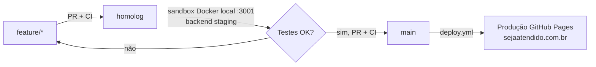

<!-- ai-summary
Plano para reduzir bugs/quebras de build em produção criando: (1) gate de CI em PRs,
(2) sandbox de homologação local via Docker apontando para backend de staging,
(3) fluxo de branches main=prod / homolog=staging com PR obrigatório.
Decisões do usuário: backend de staging separado, hospedagem do front em Docker local, PR obrigatório.
-->

# Plano: Ambiente de Homologação (Sandbox)

## Problema

Hoje todo `push` em `main` publica direto em produção (GitHub Pages → `sejaatendido.com.br`),
sem checagem de build, sem PR e sem ambiente intermediário. Resultado: bugs e quebras de
build chegam direto ao cliente.

## Objetivo

Criar uma rede de proteção em 3 camadas:

1. **Gate de CI** — nenhuma mudança entra em `main`/`homolog` se `tsc` ou `vite build` falhar.
2. **Sandbox local (homologação)** — build de produção real rodando no seu PC via Docker,
   apontando para um **backend de staging separado**, antes de promover para produção.
3. **Git flow** — `main` (produção) protegida; integração via `homolog` (staging) com PR obrigatório.

## Decisões (definidas com o usuário)

| Tema | Decisão |
|------|---------|
| Backend de homologação | Instância **separada** de staging (não usa a base de produção) |
| Hospedagem do front de homolog | **Docker local** na máquina do desenvolvedor (porta 3001) |
| Fluxo de branches | `main`=prod, `homolog`=staging, **PR obrigatório** para `main` |

---

## Fluxo de trabalho proposto



Regra de ouro: **nunca commitar direto em `main`**. Toda mudança nasce em `feature/*`,
é validada no sandbox a partir de `homolog`, e só então sobe para `main` via PR.

---

## Camada 1 — Gate de CI (maior ganho imediato)

Arquivo: `.github/workflows/ci.yml` (criado por este plano).

- Dispara em: PR para `main` e `homolog`, e push em `homolog`.
- Passos: `npm ci` → `npm run typecheck` (`tsc --noEmit`) → `npm run build`.
- Se qualquer passo falhar, o PR fica **bloqueado** (após configurar branch protection).

### Ação manual no GitHub (Settings → Branches → Branch protection rules)

Para `main` (e idealmente `homolog`):

- [ ] Require a pull request before merging.
- [ ] Require status checks to pass before merging → selecionar o check **CI / quality**.
- [ ] Require branches to be up to date before merging.
- [ ] (Opcional) Require linear history.

> Sem essa configuração o workflow roda, mas não bloqueia merges. É o passo que transforma
> o CI em um "portão" de verdade.

---

## Camada 2 — Sandbox local de homologação (Docker)

Arquivos criados por este plano:

- `docker-compose.staging.yml` — sobe o build de produção apontando para o backend de staging, na **porta 3001** (produção local usa 3000, então não conflita).
- `Dockerfile` — passa a aceitar args extras (`VITE_MP_PUBLIC_KEY`, `VITE_GOOGLE_CLIENT_ID`, `VITE_VAPID_PUBLIC_KEY`) além de `VITE_API_URL`.
- Scripts npm `sandbox:*` para subir/derrubar/ver logs.

### Variáveis de ambiente (arquivo `.env` local — NUNCA commitado)

O `.gitignore` já ignora `.env` e `.env.*`. Crie um `.env` na raiz com:

```dotenv
# URL do backend de STAGING (instância separada da produção)
VITE_API_URL=https://sejaatendido-staging-backend.onrender.com

# Chaves de TESTE / sandbox (não usar chaves de produção em homolog!)
VITE_MP_PUBLIC_KEY=TEST-xxxxxxxx-xxxx-xxxx       # Mercado Pago: credencial de TESTE
VITE_GOOGLE_CLIENT_ID=xxxxxxxx.apps.googleusercontent.com
VITE_VAPID_PUBLIC_KEY=                            # opcional (push web)
```

> Importante: em homologação use **credenciais de teste do Mercado Pago** para não gerar
> cobranças reais. Use também usuário/dados de teste no backend de staging.

### Como usar o sandbox

```powershell
# Subir o sandbox (build + container na porta 3001)
npm run sandbox:up

# Acessar
start http://localhost:3001

# Acompanhar logs
npm run sandbox:logs

# Derrubar
npm run sandbox:down
```

---

## Camada 3 — Git flow e branches

Passos (executar uma vez):

```powershell
git checkout main
git pull
git checkout -b homolog
git push -u origin homolog
```

A partir daí:

```powershell
# Nova mudança
git checkout homolog
git pull
git checkout -b feature/minha-mudanca
# ... editar ...
git push -u origin feature/minha-mudanca
# Abrir PR feature/* -> homolog (CI roda)
# Testar no sandbox local (npm run sandbox:up)
# Abrir PR homolog -> main (CI roda) -> merge publica em produção
```

---

## Camada 4 — Backend de staging (fora deste repositório)

Ações no repositório do backend / painel do Render:

- [ ] Criar um **2º Web Service** no Render a partir da branch de staging do backend.
- [ ] Banco de dados separado (ou schema de teste) — nunca apontar para o banco de produção.
- [ ] Variáveis de ambiente de teste (Mercado Pago sandbox, e-mail de teste, etc.).
- [ ] Anotar a URL final e colocá-la em `VITE_API_URL` do `.env` local do sandbox.
- [ ] Habilitar CORS para `http://localhost:3001` no backend de staging.

---

## Pendências que dependem do usuário

- [ ] Provisionar o backend de staging no Render e obter a URL.
- [ ] Obter credencial de **teste** do Mercado Pago.
- [ ] Configurar branch protection em `main` (e `homolog`) no GitHub.
- [ ] Confirmar nome final da branch de staging (`homolog` proposto).

## Resultado esperado

- Build quebrado é barrado no PR, antes de chegar em produção.
- Toda mudança é validada num ambiente idêntico ao de produção (Docker + Nginx) localmente.
- Produção (`main`) só recebe código já testado em homologação.
